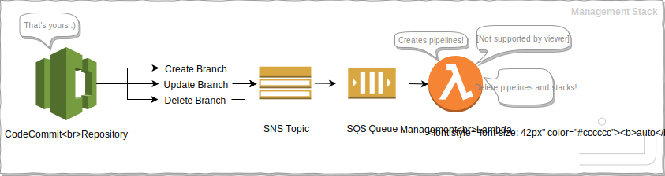
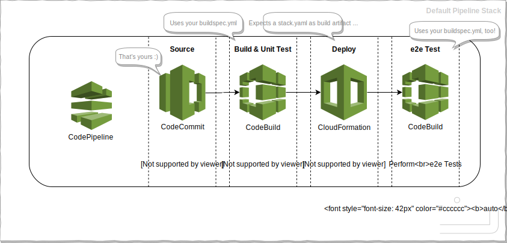

# WORK IN PROGRESS - DO NOT USE YET


### autopipe - Automatic CI/CD for AWS
Automatically manage branch-level [AWS CodePipelines](https://aws.amazon.com/codepipeline/).

- Complete deployment infrastructure inside the application repository
- Out-of-the-box default pipeline configuration
- Stay flexible with custom pipelines
- Let DevOps & developers work in the same domain
- Leverage AWS CI/CD toolchain, save costs on the way

_autopipe_ ...
- ... _**creates**_ a pipeline for every new branch
- ... _**updates**_ that pipeline on every branch push if necessary
- ... _**executes**_ that pipeline on every branch push
- ... _**deletes**_ that pipeline on branch deletion
- ... _**removes**_ all deployed application stacks on branch deletion

The definition(s) of the pipeline(s) can be self-managed (i.e. custom) 
by the project itself, or a default pipeline provided by _autopipe_ is 
used. If you use (a) custom pipeline(s), you can work on the 
pipeline definition in a branch, and that branch's pipeline will 
automatically get updated upon a push to that branch with the new
pipeline.

Yes, that _**is**_ awesome - I know. You're welcome. ;)


### Prerequisites
- [AWS CodeCommit](https://aws.amazon.com/codecommit/) project repository
    - ```npm init``` was run
    - ```buildspec.yml``` is configured (see [AWS CodeBuild](https://aws.amazon.com/codebuild/))
- [AWS CLI](https://aws.amazon.com/cli/) installed and configured
- Sufficient permissions in your AWS account :)

### Setup
1. ```npm install --save-dev @rimesime/aws-autopipe```

1. Deploy the management stack for this repository:
    - ```autopipe create -r <repository-name> -s <bucket-name> [-p <profile>]```
        - ```<repository-name>``` is the name of your AWS CodeCommit repository
        - ```<bucket-name>``` is your AWS S3 bucket for all artifacts (will be 
          created if not existing)

You just deployed your management stack for this repository:



### More Commands
If you need to setup a branch pipeline for a branch that existed before 
installing _autopipe_ and you do not want to push to that branch now (this 
would automatically setup a branch pipeline), run:
- ```autopipe create -r <repository-name> -b <branch-name> [-p <profile>]```
    
To manually tear down a pipeline (gets redeployed on branch push), run:
- ```autopipe delete -r <repository-name> -b <branch-name> [-p <profile>]```
    
To manually tear down the management stack for this repository, run:
- ```autopipe delete -r <repository-name> [-p <profile>]```

### Pipeline Configuration
#### The Default Pipeline
If no custom pipelines are configured in your repository or if no entry 
can be found in your repository configuration that matches the branch 
name whos pipeline shall be created or updated, _autopipe_ will use 
a default pipeline template.



This default pipeline template can be found here: [management/lambda/templates/pipeline-default.yaml](management/lambda/templates/pipeline-default.yaml)

#### Your Custom Pipelines
Create a file called ```autopipe.config.json``` for a mapping of your 
custom pipeline templates to branches.
<details>
  <summary>Example:</summary>
  
```
{
  "pipelines": [
    {
      "branch": "master",
      "pipeline": "pipelines/master.yaml",
      "description": "Custom pipeline for master branch"
    },
    {
      "branch": "develop",
      "pipeline": "pipelines/develop.yaml",
      "description": "Custom pipeline for develop branch"
    },
    {
      "branch": "",
      "pipeline": "pipelines/default.yaml",
      "description": "Custom default pipeline for all (other) branches"
    },
    {
      "branch": "no-pipe-branch",
      "pipeline": "",
      "description": "Do not deploy a pipeline for this branch"
    }
  ]
}
```
</details>

##### Remarks:
- If you need to define a custom default pipeline, use an empty branch name. 
- If you need to exclude a branch from _autopipe_, use an empty pipeline attribute.

##### Which Pipeline Definition Gets Used
1. If an entry in ```autopipe.config.json``` for that branch name is found:
    1. If the pipeline attribute is set to a template, that custom pipeline will be used.
    1. If the pipeline attribute is empty, no pipeline is deployed.
1. Else if a default pipeline template is found in ```autopipe.config.json```, 
   that custom default pipeline template is used.
1. Otherwise a default pipeline template provided by _autopipe_ is used.